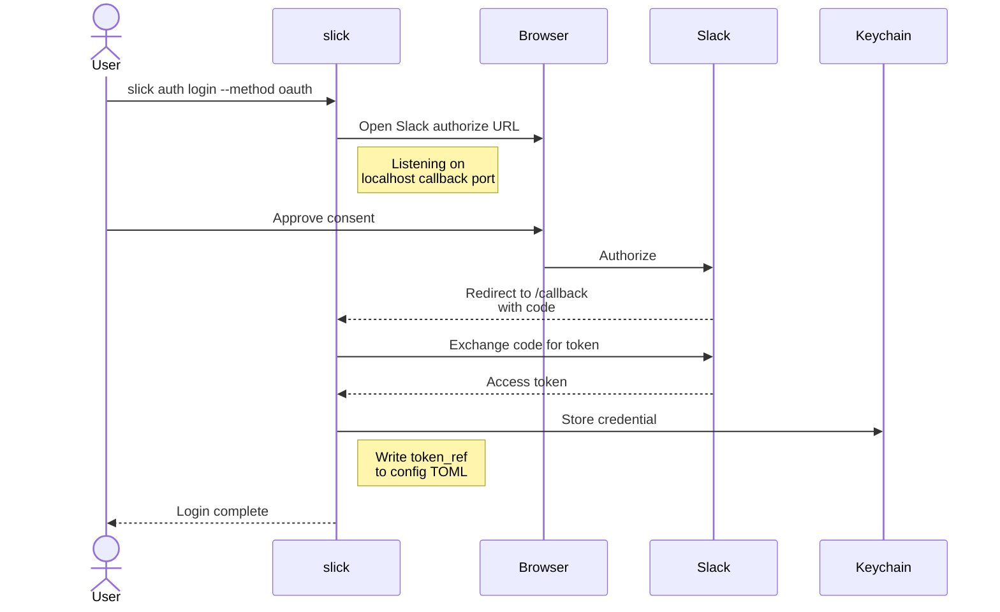

# slick auth

**Manage** Slack authentication. Login validates a token with the Slack API
and stores a structured credential reference in the local keychain. Config
holds the keychain reference; it never holds a raw token.

## auth login

Create or replace a workspace profile.

The local profile name can come from either flag: the hidden
`--workspace-name <NAME>` (preferred) or the global `--workspace <NAME>`
selector — if `--workspace-name` is empty, slick reuses the value of
`--workspace`. On a TTY, omitting both drops into an interactive form
that prompts for the missing fields.

For token mode, slick calls Slack's `auth.test` after validating the
token and fills in `team_id` / `team_name` from the response. Pass
`--team-id` / `--team-name` only if you need to override what Slack
returns (rare).

=== "Interactive"

    TTY only; prompts for workspace name, method, and whatever else is missing:

    ```sh
    slick auth login
    ```

=== "OAuth"

    Fully scripted. `--workspace-name` and `--oauth-client-id` are required, and `--oauth-callback-port` must match the redirect URL in your manifest:

    ```sh
    slick auth login --workspace-name default --method oauth \
        --oauth-client-id 1234567890.0987654321 \
        --oauth-callback-port 53221
    ```

=== "Token · stdin"

    The token never appears in argv, and slick derives the workspace identity from `auth.test`:

    ```sh
    printf '%s\n' "$SLACK_TOKEN" | slick auth login \
        --workspace-name default --method token --token-stdin
    ```

=== "Token · file"

    Read the token from a file; path expansion is supported:

    ```sh
    slick auth login --workspace-name default --method token \
        --token-file ~/.slack-token
    ```

=== "Token · env"

    Pass the name of an environment variable, not its value:

    ```sh
    slick auth login --workspace-name default --method token \
        --token-env SLACK_TOKEN
    ```

### Output

=== "Human"

    Human (success — same shape for OAuth and token-mode logins; both end with a
    single `Login complete` event on stdout):

    ```text
    Login complete workspace=default team_id=T123ABC456 team_name="Example Inc" token_type=user authenticated=true
    ```

    Human (token env var unset or empty — validation error):

    ```text
    ERR token environment variable SLACK_TOKEN is empty type=validation_error exit_code=4
    ```

=== "JSON"

    JSON envelope on a successful login (`auth.login`):

    ```json
    {
      "meta": {"command": "auth.login", "workspace": "default", "timestamp": "2026-05-26T03:00:56Z", "request_id": "337f5bd1-a5f2-4bb8-8da5-510cb801f62d"},
      "data": {
        "workspace": "default",
        "authenticated": true,
        "token_type": "user",
        "team_id": "T123ABC456",
        "team_name": "Example Inc"
      },
      "errors": []
    }
    ```

### Flags

??? note "Flags"

    | Flag | Value | Description |
    |------|-------|-------------|
    | `--workspace-name` | `<NAME>` | Local profile name. Hidden in --help. Falls back to the global --workspace value when omitted. |
    | `-s`, `--token-stdin` | | Read Slack token from stdin |
    | `-f`, `--token-file` | `<FILE>` | Read Slack token from file |
    | `-e`, `--token-env` | `<VAR>` | Read Slack token from named environment variable |
    | `-T`, `--team-id` | `<ID>` | Slack workspace ID (overrides auth.test) |
    | `-N`, `--team-name` | `<NAME>` | Slack workspace display name (overrides auth.test) |
    | `-m`, `--method` | `<METHOD>` | Auth mechanism: oauth or token (default: token) |
    | `-C`, `--oauth-client-id` | `<ID>` | Slack OAuth client ID |
    | `-r`, `--oauth-redirect-url` | `<URL>` | Slack OAuth redirect URL configured on the app |
    | `-p`, `--oauth-callback-port` | `<PORT>` | Local OAuth callback port; 0 for OS-assigned |
    | `-F`, `--force` | | Overwrite an existing authenticated profile |

The profile-name resolution order is: `--workspace-name` flag, then the
global `--workspace` flag value, then the TTY interactive form. After
those, slick errors with `workspace-name is required` if it still
doesn't have one.

For token mode, slick calls `auth.test` after the token validates and
fills `team_id` / `team_name` from the response. Pass `--team-id` /
`--team-name` only when you need to override what Slack returns.

### OAuth flow

1.  slick opens the Slack authorize URL in the default browser and listens on
   the configured local port.
2.  The Slack consent screen redirects back to `http://localhost:<port>/callback`.
3.  slick exchanges the code for a token, stores it in the keychain, and
   writes a `token_ref` to the config TOML.



During the wait, a spinner displays the authorize URL on stderr so you can
copy it if the browser launch fails. ++ctrl+c++ cancels the wait. The default
OAuth-wait budget is two minutes (`OAuthTimeout`); the token-exchange POST
gets its own fresh per-request budget.

### Common errors

| Error | Cause | Fix |
|-------|-------|-----|
| `workspace profile is already authenticated; rerun with --force to overwrite auth fields` | Profile metadata + keychain credential both exist. | Pass `--force` to overwrite. The guard checks the keychain too, so a profile whose credential is gone (e.g. keychain reset) does not trip it. |
| `oauth flow timed out waiting redirect_url=…` | The OAuth window stayed open longer than `OAuthTimeout` (default 2m). | Re-run; consider raising `OAuthTimeout` if your IdP redirect is slow. |
| `invalid_auth` / `token_revoked` | Token is bad or has been revoked on Slack's side. | Re-run `auth login`. |

## auth status

Show auth state for every configured workspace. The action label colour-codes
state at a glance:

*   `Authenticated` (bold green) — credentials valid; `authenticated=true`.
*   `Authentication invalid` (red) — credentials exist but Slack rejected them.
*   `Credentials missing` (red) — workspace metadata exists; no credential in
  the keychain.

```sh
slick auth status
```

=== "Human"

    Human output:

    ```text
    Authenticated workspace=default team_id=T123ABC456 team_name="Example Inc" token_type=user authenticated=true
    ```

=== "JSON"

    JSON envelope (authenticated profile):

    ```json
    {
      "data": {
        "workspaces": [
          {
            "workspace": "default",
            "authenticated": true,
            "token_type": "user",
            "team_id": "T123ABC456",
            "team_name": "Example Inc",
            "validation_state": "valid"
          }
        ]
      }
    }
    ```

    JSON envelope (workspace metadata intact but no credential — the state
    after a destructive `auth logout`). `validation_state` flips from `valid`
    to `missing` and `authenticated` becomes `false`:

    ```json
    {
      "data": {
        "workspaces": [
          {
            "workspace": "default",
            "authenticated": false,
            "token_type": "user",
            "team_id": "T123ABC456",
            "team_name": "Example Inc",
            "validation_state": "missing"
          }
        ]
      }
    }
    ```

## auth switch

Change the default workspace selected by `--workspace`.

```sh
slick auth switch <workspace>
```

Pass the workspace key as it appears in `slick workspace list`. Whitespace in
the argument is trimmed; `--debug` logs the trim.

### Output

=== "Human"

    Human:

    ```text
    Workspace switched workspace=default authenticated=false
    ```

=== "JSON"

    JSON envelope (`auth.switch`). `switch` only populates `workspace`; the
    other identity fields are `omitempty` and absent here. `authenticated` is
    the lone non-`omitempty` field on the struct, so it always emits — its
    `false` value is a leakage of the zero state, not an assertion about the
    profile's auth status:

    ```json
    {
      "data": {
        "workspace": "default",
        "authenticated": false
      }
    }
    ```

!!! note "Why authenticated=false appears"
    The trailing `authenticated=false` is a code-side quirk: `switch` only sets
    the workspace name on its result record, and `authenticated` is the only
    field on the shared `WorkspaceData` struct without `omitempty`, so its
    zero value leaks into the event. It is **not** an assertion that the
    profile is unauthenticated.

## auth logout

Revoke the token on Slack and delete the local credential. With `--keep-token`,
slick removes the workspace's auth fields from config but leaves the keychain
credential alone and skips Slack-side revocation.

```sh
slick auth logout <workspace>
slick auth logout default --keep-token
```

### Flags

??? note "Flags"

    | Flag | Value | Description |
    |------|-------|-------------|
    | `-K`, `--keep-token` | | Skip token revocation and local credential deletion; only removes the workspace auth fields from config |

`--keep-token` emits an Info-level notice on stderr explaining that the token
remains active in the workspace until manually revoked or it expires.

### Output

=== "Human"

    Human (destructive logout — revokes via the Slack API, deletes the keychain entry):

    ```text
    Logout complete workspace=default authenticated=false
    ```

    Human (`--keep-token`). The first line is the Info-level notice on stderr;
    the second is the result event on stdout:

    ```text
    INF --keep-token preserves the credential in keychain; the token is still valid on Slack's side until manually revoked or it naturally expires workspace=default
    Logout complete workspace=default authenticated=false
    ```

=== "JSON"

    JSON envelope (`auth.logout`). `authenticated` is forced to `false`:

    ```json
    {
      "data": {
        "workspace": "default",
        "authenticated": false
      }
    }
    ```

!!! note "Behaviour caveat"
    `--keep-token` documents itself as "removes the workspace auth fields
    from config." In practice, a subsequent `auth status` still resolves
    the workspace successfully because the credential remains in the
    keychain and status falls back to validating via `auth.test`. If you
    want `auth status` to actually report the profile as missing, use the
    destructive logout (without `--keep-token`).

## See also

*   [Manifest](manifest.md) — generate a Slack app manifest that matches the
  scopes you want.
*   [Config](config.md) — workspace preferences (default channel, attribution).
*   [Workspace](workspace.md) — list configured profiles.
*   Slack API methods: [`auth.test`](https://docs.slack.dev/reference/methods/auth.test/),
  [`oauth.v2.access`](https://docs.slack.dev/reference/methods/oauth.v2.access/),
  [`auth.revoke`](https://docs.slack.dev/reference/methods/auth.revoke/).
