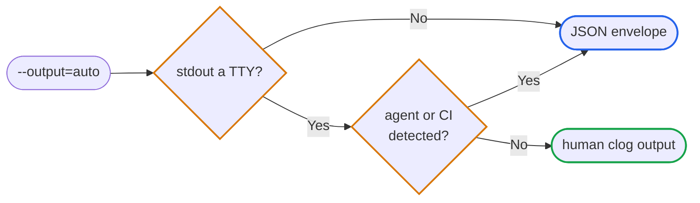

# Overview

`slick` is a headless Slack CLI for agents, scripts, and CI jobs — anywhere
you need to talk to the Slack API without a human at the keyboard.

**Send** messages and DMs, **reply** in threads, **react** to messages, **read**
channel and thread history, **search** the workspace, **set** your Slack
status, **upload** files, and **check** Slack service health — all from a
single binary that runs each of these non-interactively. Drive it with flags, stdin, or environment
variables, and the output adapts to where it runs: friendly colored text in a
terminal, structured JSON when piped or under an agent.

The binary is `slick`; the repo and Go module are `slack-cli`.

## Install

```sh
brew install matcra587/tap/slick
```

Also available via `go install` and pre-built binaries. See
[Installation](installation.md) for go install, GitHub Releases, source
builds, and upgrade paths.

The examples below assume `slick` is on `PATH`. Every visible flag has a short
form; run `slick <command> --help` for the current mapping.

## First-time setup

??? info "Prerequisite — Slack app with a user OAuth token"
    slick acts as you, so it needs a Slack app installed in your workspace
    with a **user token** (not a bot token). At minimum, that app needs
    these three user-scope permissions:

    | Scope | Enables |
    |---|---|
    | `chat:write` | Send messages |
    | `channels:read` | Resolve public channels |
    | `users:read` | `auth.test`, user lookup, identity |

    Create the app at [api.slack.com/apps](https://api.slack.com/apps). See
    [manifest](manifest.md) for an optional `slick manifest template`
    shortcut that emits a ready-to-import manifest — and for broader scope
    sets (history, DMs, reactions, file uploads, search, status updates).

With the app installed and a user token available:

```sh
slick auth login
slick auth status
```

`auth login` opens a browser for OAuth (a token via stdin / env / file is also
supported); `auth status` confirms the workspace is wired up. See
[auth](auth.md) for the full flow.

## Output modes

slick has a single output flag, `--output` (short `-o`), with four values:

*   `auto` — the default. TTY without an agent renders human-readable clog
    output; everything else renders the JSON envelope.
*   `human` — human-readable clog output.
*   `json` — full envelope with `meta`, `data`, and `errors[]`.
*   `compact` — JSON `data` only; no envelope.

Under `auto`, JSON is selected when stdout is not a TTY or when slick detects
an agent environment (e.g. `CLAUDE_CODE`, `CURSOR_TERMINAL`, `CODEX`,
`GITHUB_ACTIONS`, `CI`).



Use command-local `--blocks` when the message body is already a Slack Block
Kit JSON array.

## Exit codes

| Code | Meaning |
|------|---------|
| 0 | Success |
| 1 | `auth_failure` (`invalid_auth`, `missing_scope`, `no_permission`, expired) |
| 2 | `not_found` (`channel_not_found`, `user_not_found`, `not_in_channel`, …) |
| 3 | `rate_limit` (with `retry_after_seconds` in the error envelope) |
| 4 | `validation_error` (bad flags, malformed input, Slack rejects the value) |
| 5 | `server_error` (Slack 5xx or filesystem/runtime failure) |
| 6 | `canceled` (SIGINT/SIGTERM during a Slack call) |
| 7 | `timeout` (`--timeout` exceeded) |

JSON-mode failures put `errors[0].type`, `errors[0].message`, and
`errors[0].exit_code` on stderr. The action label (e.g. `Message sent`) goes
to stdout only on success.

## Output styling

slick uses [`gechr/clog`](https://github.com/gechr/clog) for human-mode output
and [`gechr/primer/table`](https://github.com/gechr/primer) for tables.

| Field kind | Rendering |
|---|---|
| **Identity** — `channel`, `user`, `team_id`, `workspace`, `file_id`, … | Hash-coloured from the entity palette; the same ID always renders the same colour. |
| **Human labels** — channel name, user name, file name | Plain terminal text — no colour, no hyperlink, no weight. |
| **Slack entity / permalink** | OSC 8 terminal hyperlinks when slick has enough workspace metadata. `channel_url` uses `slack://` on macOS, `https://app.slack.com/client/<team>/<conversation>` elsewhere; absent without a team ID. Parse JSON for raw IDs. |
| **Time** — `ts`, `fetched_at`, `expiration` | clog's `FieldTime` magenta. |
| **Bool** | Coloured by polarity — see below. |

Bool polarity:

| Tier | Examples | True | False |
|---|---|:-:|:-:|
| Alarming-on-true | `is_archived`, `deleted`, `truncated` | red | dim |
| Both states matter | `authenticated`, `exists` | green | red |
| Routine-on-true | `is_member` | dim | default |

`dry_run` and [`cache clear`](cache.md#cache-clear)'s `cleared` are retained
where they're the only signal of what happened; otherwise the action label
plus `errors[]` carries success/failure.

Field order follows a canonical taxonomy:
*where → what → when → state → detail → numbers → diagnostics → pagination*.
An AST-walking test enforces it on every CI run — see
[`internal/cli/output/field_order_test.go`](https://github.com/matcra587/slack-cli/blob/main/internal/cli/output/field_order_test.go).

## Attribution

In an agent or CI environment, the four mutating commands (`message send`,
`message edit`, `reply`, `file upload`) attach a Block Kit context block
marking the message as automated. Override per call with
`--attribution-label`, `--attribution-emoji`, `--attribution-message`, or
gate the block itself with `--attribution` / `--no-attribution` — both
flags trump config defaults *and* env detection, so a single command can
attribute on a workspace where it's off (or suppress where it's on).

??? note "Detection triggers"

    The authoritative list lives in [`internal/agent/detect.go`](https://github.com/matcra587/slack-cli/blob/main/internal/agent/detect.go).

    *   **AI assistants** — Claude Code, Cursor, Codex, Aider, Cline, Windsurf,
        GitHub Copilot, Codeium, Amazon Q, Gemini Code Assist, Cody.
    *   **CI** — GitHub Actions, Buildkite, Jenkins, GitLab CI, CircleCI,
        Travis CI, Bitbucket Pipelines, TeamCity, Azure Pipelines, plus the
        generic `CI` variable.
    *   **Cron / automation** — `CRON`, `CRON_JOB`, `SLACK_CLI_AGENT`.

The attribution context block reflects the detection state in the rendered
Slack message:

*   :robot_face: *Sent via slick (agent mode)* — slick auto-detected an
    agent or CI environment.
*   :robot_face: *Sent via slick* — slick is running interactively (no
    agent triggers) but `attribution.enabled = true` is set in config, or
    `--attribution` is passed on the command line.

Override either piece with `--attribution-message` (text body) or
`--attribution-emoji` (leading emoji).

Config can pin attribution defaults per workspace:

```sh
slick config set workspaces.default.attribution.enabled true
slick config set workspaces.default.attribution.emoji :robot_face:
slick config set workspaces.default.attribution.message "Sent via build agent"
```

## Configuration paths

*   Config: `${SLICK_CONFIG:-${XDG_CONFIG_HOME:-~/.config}/slick/config.toml}`.
  `SLACK_CLI_CONFIG` remains as a legacy override.
*   Cache: `${XDG_CACHE_HOME:-~/.cache}/slick/<profile>/`.
*   Path inputs (`SLICK_CONFIG`, `--token-file`, `--file`, …) expand `~` and
  environment variables.

Tokens never appear in argv, TOML, stdout, stderr, or any of these docs.
Auth-owned fields store keychain or secret-manager references; config
commands do not edit them.

## Further reading

*   Per-command pages above for flags, examples, and JSON shapes.
*   [`slick agent guide`](agent.md#agent-guide) for machine-readable runbooks designed for
  agent consumption.
*   [`slick agent schema`](agent.md#agent-schema) for the full command tree and exit-code
  contract in JSON.
*   [Repo source](https://github.com/matcra587/slack-cli)
